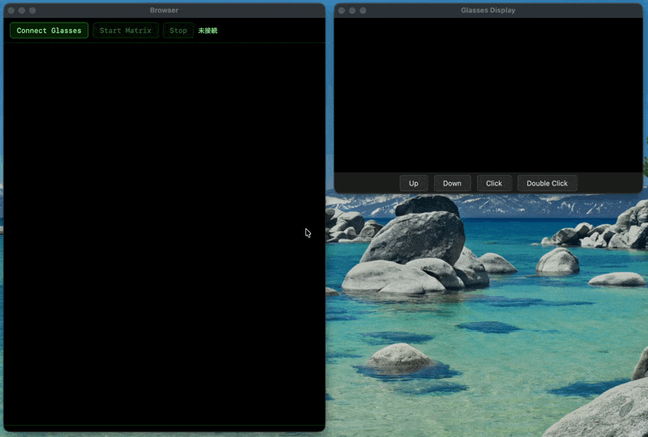
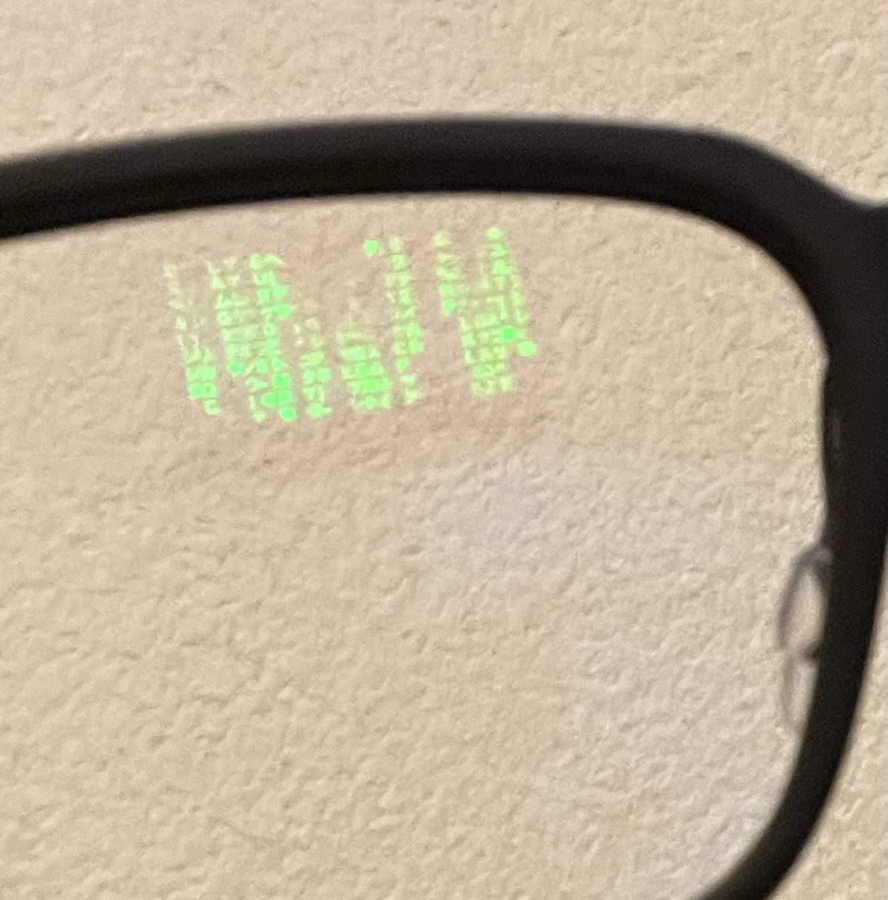

# Even G2 Matrix Rain

映画「The Matrix」風のデジタルレインを [Even G2](https://www.evenrealities.com/smart-glasses) スマートグラスに表示するアプリ。

HTMLプレビュー（Canvas描画）とG2グラス（画像転送）の2系統で動作する。

## デモ





- 参考イメージ（外部リンク）: https://pbs.twimg.com/media/HCE7FQhagAA_u2D?format=jpg&name=medium

> **⚠️ 実機での表示について:** 上のデモGIFはシミュレーター上の動作です。G2実機ではBLE経由の画像転送（実効1–2 FPS）のため、シミュレーターと比べて描画が大幅にカクつきます。体感速度を補正するため、1フレームで複数ティックを進める処理を入れています。

## セットアップ

```bash
pnpm install
```

## 起動方法

```bash
# devサーバー起動（5174を優先。使用中なら自動で次ポート）
# 起動後、実機接続用QRコードを自動表示
pnpm dev
# → ターミナルに表示されたURLを使う（例: http://localhost:5176/）

# QR自動表示なしで起動
AUTO_QR=0 pnpm dev
```

## シミュレーターで確認

```bash
# 自動検出で起動（localhost:5174-5180 の中からこのアプリを検出）
# 実機接続用QRコードも自動表示
pnpm sim

# 複数devサーバーを起動している場合はURLを明示
pnpm sim -- http://localhost:5176/

# QRだけ表示したい場合（devサーバーが起動済み）
pnpm qr

# URL明示でQR表示
pnpm qr -- http://localhost:5176/

# または直接
npx @evenrealities/evenhub-simulator --glow http://localhost:<port>/
```

- G2実機がなくても、PC上のEvenHub SimulatorだけでUI/イベント検証が可能
- 実機との差分はありうるため、最終確認はG2実機で実施推奨
- `@evenrealities/evenhub-simulator` の公開ドキュメント上は Linux / macOS / Windows の設定パス記載あり

ブラウザにアプリUI、別ウィンドウにG2ディスプレイシミュレーター（576x288, 4bitグレースケール）が開く。

操作手順:
1. **Connect Glasses** → Bridge接続
2. **Start Matrix** → Matrix rain再生開始

## アーキテクチャ

```
[HTMLプレビュー]       [G2グラス/シミュレーター]
Canvas描画              ImageContainerProperty x2
(大画面, 高FPS)         (200x200px, PNGバイト転送)
       ↑                       ↑
    previewState             g2State     ← 独立したMatrixState
       ↑                       ↑
    nextMatrixFrame()     nextMatrixFrame() × G2_TICKS_PER_FRAME
```

- **HTMLプレビュー**: Canvas + 文字ごとの色・グロー・明暗（先頭=白, トレイル=緑グラデーション）
- **G2グラス**: オフスクリーンCanvasでMatrix rainを描画 → PNG変換 → `updateImageRawData()` で画像転送
  - G2は4bitグレースケール（16段階の緑）に自動変換するため、輝度差が表現される
  - 画像コンテナ2つを縦並べ（各200x100px → 合計200x200px）で表示面積を最大化
  - BLE転送が低速なため、1フレームで複数ティック進めて体感速度を補正

## G2画像転送の制約と知見

| 項目                   | 値・備考                                                                       |
| ---------------------- | ------------------------------------------------------------------------------ |
| 画像コンテナ最大サイズ | 200 x 100 px（SDK制限）                                                        |
| 表示面積の最大化       | コンテナ2つ縦並べで **200 x 200 px**                                           |
| imageData形式          | **PNGファイルバイト列（`number[]`）** が動作確認済み。base64文字列は動作しない |
| isEventCapture         | ImageContainerPropertyにはない → **TextContainerPropertyを併設**する必要あり   |
| 更新頻度               | 順次実行（`await`必須）。BLE経由のため実効1-2 FPS                              |
| 全角カタカナ           | テキストモードでは1文字が2列幅を消費（~13列）。画像モードなら制約なし          |
| 半角カタカナ           | G2のテキストレンダラーでは描画されない（空白になる）                           |

## ファイル構成

| ファイル             | 役割                                          |
| -------------------- | --------------------------------------------- |
| `index.html`         | エントリーポイント                            |
| `src/main.ts`        | UI・Canvas描画・G2画像転送・フレームループ    |
| `src/matrix-rain.ts` | Matrix rainアルゴリズム（明暗追跡・文字変異） |
| `src/bridge.ts`      | Even G2 Bridge初期化・Mock fallback           |
| `src/log.ts`         | イベントログ                                  |
| `vite.config.ts`     | Vite設定                                      |

## 実機接続

1. iPhone に Even App をインストール
2. G2 を iPhone に BLE ペアリング
3. `pnpm dev` または `pnpm sim` を実行し、ターミナルに出力されたQRコードを表示
4. iPhone の Even App（Even Hub）で QR を読み込み
5. 必要に応じて Even App 側でURL（`http://<your-ip>:<port>/`）を直接指定
6. G2で動作確認

## 公式リファレンス

- Even Hub Developer Portal: https://evenhub.evenrealities.com/
- Even Hub SDK（公式）: https://www.npmjs.com/package/@evenrealities/even_hub_sdk
- EvenHub Simulator（公式）: https://www.npmjs.com/package/@evenrealities/evenhub-simulator
- EvenHub CLI（公式）: https://www.npmjs.com/package/@evenrealities/evenhub-cli
- Even G2 製品情報: https://www.evenrealities.com/smart-glasses

## 参考コミュニティ情報

- G2開発ノート（非公式・逆解析含む / 作者が非公式と明記）: https://github.com/nickustinov/even-g2-notes/blob/main/G2.md
- even-dev（コミュニティ管理のシミュレーター開発環境）: https://github.com/BxNxM/even-dev

## ライセンス方針

- 本リポジトリのソースコードは MIT ライセンス（`LICENSE`）
- 依存パッケージのライセンスはそれぞれ個別に適用される
- 2026-02-26時点で npm 表示上、`@evenrealities/even_hub_sdk` と `@evenrealities/evenhub-simulator` は MIT
- `@evenrealities/evenhub-cli` は npm の License 表示が `none` のため、利用時は最新の配布条件を確認推奨
- Even Hub 側が配布・公開時に追加ポリシーを要求する可能性があるため、提出時は Developer Portal の最新規約を確認すること

## ライセンス

MIT
